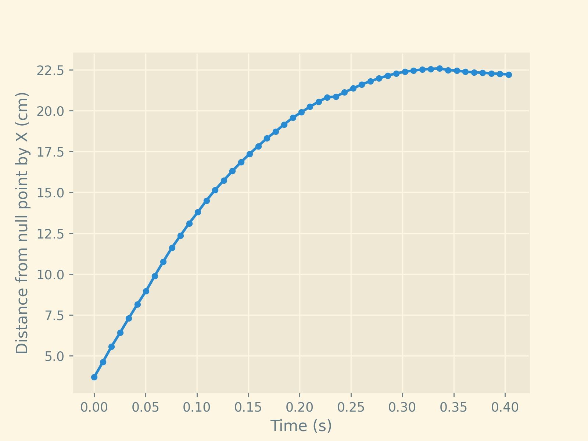

# 17. Arrester Bed

A sand-filled lane results in the dissipation of the kinetic energy of
a moving vehicle. What length is necessary for such an arrester bed to
entirely stop a passively moving object (e.g. a ball)? What parameters
does the length depend on?

[2023 IYPT Problems](https://www.iypt.org/problems/problems-for-the-36th-iypt-2023/)

# Tracker of an object's moving

### How it looks


### Result graph



### How to run

You will need:
* Python 3.10 or higher
* pip

Run in shell:
```bash
git clone https://1ixi1/arrester-bed-tracker && cd arrester-bed-tracker
pip install -r requirements.txt
python stop-tracker
```

**Next, you can see [the code](stop-tracker/__main__.py), use
it for your trackers or problem solving and have fun!**

<div style="text-align: right; font_size: 8">
<a href='https://bntu.by/liceum/liceum'>Lyceum of BNTU</a>
</div>
